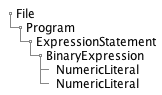

# 教科書

https://rabbit-house.tokyo/ast-book-sample.pdf

### AST の木構造

### メモ

`identifier`:識別子
`leteral`:識別子

https://astexplorer.net/

visitor パターンの話で、出てくる第 1 級関数とは一体
https://ja.wikipedia.org/wiki/%E7%AC%AC%E4%B8%80%E7%B4%9A%E9%96%A2%E6%95%B0

# 読み解きたいもの

https://github.com/zetachang/react-native-dotenv
